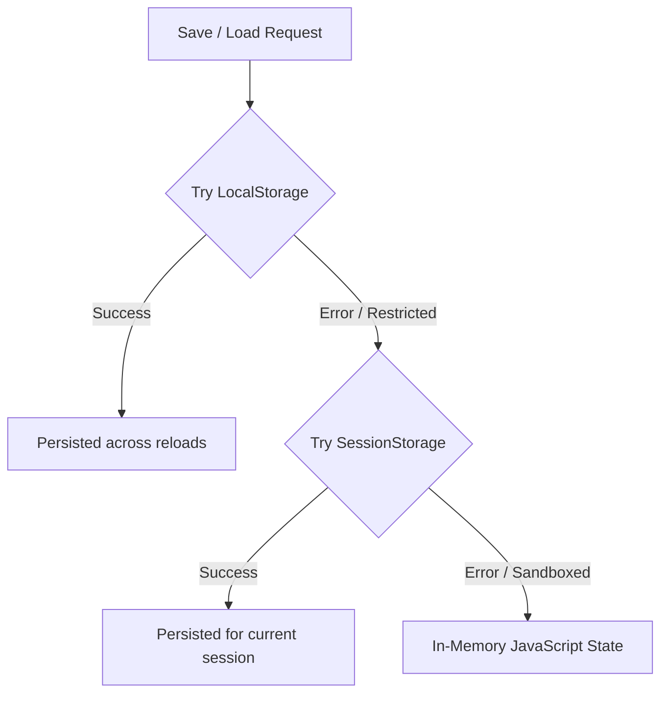

<div align="center">

# 🎮 LAKSHMAN GAMES BROWSER
### *A Cyber-Retro Game Hub, WebGL Arcade & 3D Interactive Portfolio*

[](https://lakshmanragu.github.io/LakshmanGamesBrowser/)
[](https://lakshmanragu.github.io/lakshman_portfolio.github.io/)
[](https://lakshmanragu.itch.io/)
[](https://www.artstation.com/lakshmanragu)
[](LICENSE)

<br/>

```
  ██████╗  █████╗ ███╗   ███╗███████╗    ██╗  ██╗██╗   ██╗██████╗ 
 ██╔════╝ ██╔══██╗████╗ ████║██╔════╝    ██║  ██║██║   ██║██╔══██╗
 ██║  ███╗███████║██╔████╔██║█████╗      ███████║██║   ██║██████╔╝
 ██║   ██║██╔══██║██║╚██╔╝██║██╔══╝      ██╔══██║██║   ██║██╔══██╗
 ╚██████╔╝██║  ██║██║ ╚═╝ ██║███████╗    ██║  ██║╚██████╔╝██████╔╝
  ╚═════╝ ╚═╝  ╚═╝╚═╝     ╚═╝╚══════╝    ╚═╝  ╚═╝ ╚═════╝ ╚═════╝ 
```

**Lakshman Games Browser** is a cyberpunk-meets-retro interactive web arcade and developer showcase built with pure modern web technologies and Three.js. It features integrated WebGL game launching, 3D parallax tilt effects, customizable RGB spectrum modes, floating particle physics, and an interactive End Portal social gateway.

[Explore Live Demo](https://lakshmanragu.github.io/LakshmanGamesBrowser/) • [Report Bug](https://github.com/LakshmanRagu/LakshmanGamesBrowser/issues) • [Request Feature](https://github.com/LakshmanRagu/LakshmanGamesBrowser/issues)

</div>

---

## 📑 Table of Contents

- [✨ Key Features](#-key-features)
- [🕹️ Featured Games](#️-featured-games)
- [🌌 Visual Effects & Aesthetics](#-visual-effects--aesthetics)
- [🎨 Dynamic Theming & Gamer RGB Mode](#-dynamic-theming--gamer-rgb-mode)
- [🛠️ Architecture & Tech Stack](#️-architecture--tech-stack)
- [📂 Project Structure](#-project-structure)
- [🚀 Quick Start & Local Development](#-quick-start--local-development)
- [⚙️ Configuration Guide](#️-configuration-guide)
  - [Adding New Games](#1-adding-new-games)
  - [Customizing Visual Effects (VFX)](#2-customizing-visual-effects-vfx)
  - [Tuning Gamer RGB Wave Mode](#3-tuning-gamer-rgb-wave-mode)
- [💾 State & Storage Architecture](#-state--storage-architecture)
- [🌌 Minecraft End Portal Gateway](#-minecraft-end-portal-gateway)
- [👨‍💻 Author & Connect](#-author--connect)
- [📄 License](#-license)

---

## ✨ Key Features

- **🕹️ In-Browser WebGL Arcade**: Launch and play WebGL itch.io games directly within a responsive modal engine, with pop-out new-tab capabilities and keyboard/mouse detection.
- **🖼️ 3D Parallax Tilt Cards**: Interactive game cards powered by `VanillaTilt.js` featuring real-time perspective tilt, depth lighting, and glare reflections.
- **✨ Three.js Particle Universe**: Interactive background canvas with 1,500+ particles reacting smoothly to mouse velocity and scroll depth.
- **🌈 Addressable Gamer RGB Spectrum**: 4-zone asynchronous HSL phase modulation system with customizable wave speed and real-time color shifting.
- **🔍 Instant Real-Time Search**: Sub-millisecond title and tag search filtering across your entire games library.
- **⭐ Library Management**: Toggle favorites, browse categorized sections (Browser vs. Downloadable), and track recently played games.
- **🔮 Dynamic Thumbnail Auto-Resolver**: Intelligent fallback scraper that queries OpenGraph and page metadata through CORS proxies when thumbnails aren't pre-defined.
- **🎛️ System Preferences Control Center**: Granular toggles for void stars, drifting starfields, Ender embers, cursor trails, click bursts, accent colors, and RGB wave speeds.
- **🛡️ Sandbox-Proof Fallback Storage**: Seamless cascading storage (`localStorage` → `sessionStorage` → in-memory) preventing crashes in sandboxed iframe environments.
- **📱 Fully Responsive Design**: Mobile-ready layout with slide-out navigation drawer and touch-friendly controls.

---

## 🕹️ Featured Games

| Title | Type | Genre | Description / Status | Action |
| :--- | :---: | :---: | :--- | :---: |
| **THE LONG TAKE** | `WebGL` | Action | Fast-paced cinematic action experience playable in-browser. | [Play Now](https://lakshmanragu.itch.io/the-long-take) |
| **SCRAPING ANGEL** | `Download` | Horror | Atmospheric psychological survival experience. | [Download](https://reirann.itch.io/scraping-angel) |
| **SKY SLIME** | `Download` | Platformer | Physics-driven vertical platforming challenge. | [Download](https://lakshmanragu.itch.io/sky-slimed) |
| **BLAST ROCK** | `Download` | Shooter | High-energy arcade space shooter built for game jams. | [Download](https://itch.io/jam/portfolio-builders-jam-week-67/rate/4455852) |
| **WELCOME BACK** | `Download` | Adventure | Narrative-rich exploration and puzzle adventure. | [Download](https://reirann.itch.io/welcome-back) |
| **GROW A CITY** | `Download` | Strategy | Isometric city builder and resource allocation simulation. | [Download](https://reirann.itch.io/grow-a-city) |
| **ESCAPE PARKING LOT** | `Download` | Combat | Top-down vehicular combat and arena survival. | [Download](https://jeiz.itch.io/escape-the-parking-lot) |
| **RUINS OF THE OLD WORLD** | `Download` | Adventure | Ancient mystery exploration through ruined landscapes. | [Download](https://lakshmanragu.itch.io/ruins-of-the-old-world) |
| **BEACH SIDE RESTAURANT** | `Download` | Simulation | Time-management and culinary service simulation. | [Download](https://lakshmanragu.itch.io/beach-side-restaurant) |
| **GDKNIGHT THE 1ST** | `Download` | Action | Retro hack-and-slash knight combat odyssey. | [Download](https://lakshmanragu.itch.io/gdknight-the-1st) |

---

## 🌌 Visual Effects & Aesthetics

The UI is built with layered CSS3 animations and hardware-accelerated WebGL:

```
[Layer 0]  Three.js WebGL Particle Starfield (Canvas, Depth: -4)
    ↓
[Layer 1]  Void Radial Gradient Backdrop (CSS, Depth: -3)
    ↓
[Layer 2]  CSS Twinkling Starfield Generator (Depth: -2)
    ↓
[Layer 3]  Floating Ender Ember Particles (Depth: -1)
    ↓
[Layer 4]  Interactive DOM UI & Parallax 3D Glassmorphic Cards
    ↓
[Layer 5]  Dynamic Cursor Trail & Click Sparkle Bursts
```

### VFX Toggles
- **Void Stars**: Generates 150+ randomized twinkling DOM stars with individual animation durations.
- **Void Drift**: Multi-plane floating space particles creating depth parallax.
- **Ender Particles**: Glowing purple/pink embers rising vertically and dissolving into the ether.
- **Cursor Trail**: Particle sparks following mouse coordinates across the screen.
- **Click Burst**: Radial spark explosion upon clicking any interactive element.

---

## 🎨 Dynamic Theming & Gamer RGB Mode

Customize your arcade cockpit with built-in presets or addressable wave modulation:

```
Preset Swatches:
  💗 Cyber Magenta   (#ff007f)
  🩵 Neon Cyan       (#00d4ff)
  💚 Matrix Green    (#00ff00)
  💛 Arcade Amber    (#ffcc00)
  💜 Void Violet     (#9d00ff)
  🎨 Custom Wheel    (Native 24-bit RGB Picker)
```

### Gamer RGB Wave Engine
When **RGB Rainbow Mode** is enabled, a non-blocking 40 FPS timer continuously modulates HSL color phases across 4 independent UI zones:

$$\text{Hue}_{\text{Zone } n} = (\text{BaseHue} + \text{Offset}_n) \pmod{360^\circ}$$

- **Zone 1 (0° offset)**: Main glowing borders, buttons, and section titles.
- **Zone 2 (90° offset)**: Sidebar hover states, category tags, and counters.
- **Zone 3 (180° offset)**: Pixelated Enderman glowing eye color.
- **Zone 4 (270° offset)**: Radial void background ambient illumination.

---

## 🛠️ Architecture & Tech Stack

Lakshman Games Browser is engineered with zero runtime build step dependencies—fast, light, and universally deployable.

| Category | Technology / Library | Description |
| :--- | :--- | :--- |
| **Core Architecture** | Vanilla HTML5 / ES6+ JavaScript | Zero-framework, ultra-lean reactive DOM engine |
| **Styling & FX** | CSS3 Custom Properties & Animations | Hardware-accelerated transitions, scanlines, and glow filters |
| **3D Background** | [Three.js (r128)](https://threejs.org/) | WebGL particle simulation with dynamic mouse-parallax |
| **Card Parallax** | [Vanilla-Tilt.js](https://micku7zu.github.io/vanilla-tilt.js/) | Smooth 3D tilt physics and glare reflections |
| **Typography** | Google Fonts (`Press Start 2P`, `Inter`) | Arcade retro 8-bit headers paired with modern UI body text |
| **Icons** | [FontAwesome 6 Free/Pro](https://fontawesome.com/) | Consistent iconography for library controls and tags |
| **Thumbnail Proxy** | AllOrigins API | Dynamic OpenGraph cover scraping for itch.io games |
| **CI/CD Deployment**| GitHub Actions (`pages.yml`) | Automated static site deployment to GitHub Pages |

---

## 📂 Project Structure

```
LakshmanGamesBrowser/
├── .github/
│   └── workflows/
│       └── static.yml        # Automated GitHub Pages CI/CD workflow
├── css/
│   └── style.css             # Main stylesheet (1,100+ lines, theme variables & VFX)
├── js/
│   ├── app.js                # Core engine: CONFIG, state, router, cards & modal
│   └── three-bg.js           # Three.js 3D particle universe script
├── .gitattributes            # Repository line-ending and attribute configs
├── AGENT-README.md           # Instructions for AI coding assistants
├── fix_css.py                # CSS maintenance utility script
├── fix_fonts.py              # Font asset updater script
├── index.html                # Main application viewport and markup
├── instructions.txt          # Quick-reference configuration guide
├── split.js                  # Modularization helper
├── split.py                  # Component extraction utility
└── README.md                 # Professional repository documentation
```

---

## 🚀 Quick Start & Local Development

Because this project uses vanilla web standards, no `npm install` or node bundler is required!

### 1. Clone the Repository
```bash
git clone https://github.com/LakshmanRagu/LakshmanGamesBrowser.git
cd LakshmanGamesBrowser
```

### 2. Launch Locally

#### Option A: Python Built-In Server (Recommended)
```bash
# Python 3.x
python -m http.server 8000
```
Then navigate to `http://localhost:8000` in your web browser.

#### Option B: VS Code Live Server
- Install the **Live Server** extension in VS Code.
- Right-click `index.html` → Click **"Open with Live Server"**.

#### Option C: Node `npx serve`
```bash
npx serve .
```

---

## ⚙️ Configuration Guide

All configuration is centralized inside the `CONFIG` constant at the top of [`js/app.js`](js/app.js).

### 1. Adding New Games

Edit `CONFIG.games` in `js/app.js`:

```javascript
// Adding a WebGL In-Browser Playable Game:
{
    id: "my-webgl-game",
    title: "MY WEBGL GAME",
    thumbnail: "https://img.itch.zone/...", // Leave as "" for auto-scraping!
    type: "webgl",
    embedUrl: "https://itch.io/embed-upload/12345678?color=000000",
    pageUrl: "https://lakshmanragu.itch.io/my-webgl-game",
    views: "1.5K",
    tag: "Action"
},

// Adding a Downloadable Game:
{
    id: "my-download-game",
    title: "MY DOWNLOAD GAME",
    thumbnail: "https://img.itch.zone/...",
    type: "download",
    pageUrl: "https://lakshmanragu.itch.io/my-download-game",
    views: "500",
    tag: "RPG"
}
```

> [!TIP]
> **Automatic Cover Resolution**: If you leave `thumbnail: ""` empty, the application will automatically scrape the OpenGraph cover image from the itch.io `pageUrl` via a CORS proxy!

---

### 2. Customizing Visual Effects (VFX)

Fine-tune background particle counts and default switches in `CONFIG.vfx`:

```javascript
vfx: {
    stars: true,         // Enable/disable twinkling starfield
    drift: true,         // Enable/disable drifting particle field
    particles: true,     // Enable/disable rising Ender embers
    trail: true,         // Enable/disable mouse sparkle trail
    burst: true,         // Enable/disable click radial burst
    starCount: 150,      // Number of stars rendered
    particleCount: 35,   // Number of floating particles
    burstCount: 12       // Sparks per click
}
```

---

### 3. Tuning Gamer RGB Wave Mode

Tune the speed and zone angle offsets in `CONFIG.rgbMode`:

```javascript
rgbMode: {
    defaultSpeed: 3,     // Speed multiplier (1-10)
    intervalMs: 25,      // Update interval (~40 FPS)
    offsets: {
        zone1: 0,        // Accent offset (Borders & buttons)
        zone2: 90,       // Secondary offset (Tags & badges)
        zone3: 180,      // Enderman eyes offset
        zone4: 270       // Void background aura offset
    }
}
```

---

## 💾 State & Storage Architecture

To ensure the hub functions flawlessly whether hosted on a public domain, run from a local file, or embedded inside a sandboxed `<iframe>`:



### Stored Keys
- `recents`: Array of recently opened game IDs.
- `favorites`: Array of user-starred game IDs.
- `vfxConfig`: Toggle states for stars, drift, embers, trail, and burst.
- `rgbMode`: Boolean active state and current wave speed.
- `themeColor`: Active hex accent color string.

---

## 🌌 Minecraft End Portal Gateway

In the **About Me** view, social and contact links are framed within an animated pixel-art **Minecraft End Portal**:

- **12 Animated Eyes of Ender**: Pulsing ocular frames enclosing the central portal void.
- **Cosmic Void Texture**: Multi-layered animated nebula background.
- **Direct Portal Jump Buttons**:
  - 🎮 [itch.io Arcade Profile](https://lakshmanragu.itch.io/)
  - 🎨 [ArtStation 3D Portfolio](https://www.artstation.com/lakshmanragu)
  - ✉️ [Direct Email Contact](mailto:lakshmannarainragubathy@gmail.com)

---

## 👨‍💻 Author & Connect

**Lakshman Narain Ragubathy**  
*Game Developer & 3D Artist*

- 🌐 **Portfolio**: [lakshmanragu.github.io](https://lakshmanragu.github.io/lakshman_portfolio.github.io/)
- 🕹️ **itch.io**: [lakshmanragu.itch.io](https://lakshmanragu.itch.io/)
- 🎨 **ArtStation**: [artstation.com/lakshmanragu](https://www.artstation.com/lakshmanragu)
- 💼 **GitHub**: [@LakshmanRagu](https://github.com/LakshmanRagu)
- 📧 **Email**: [lakshmannarainragubathy@gmail.com](mailto:lakshmannarainragubathy@gmail.com)

---

## 📄 License

This project is licensed under the **MIT License** — feel free to use, modify, and distribute for personal and commercial projects.

<div align="center">
  <sub>Built with 💜 & 🕹️ by Lakshman Narain Ragubathy. Powered by HTML5, CSS3, Three.js & Vanilla JS.</sub>
</div>
